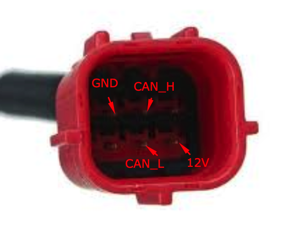
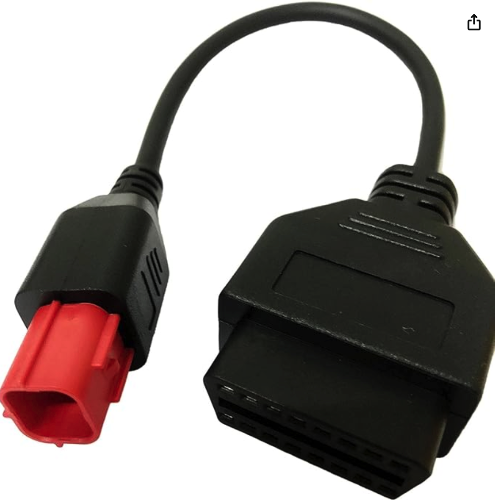

# KTM CAN Bus resources

For 2024+ KTM Super Duke R EVO 1390

Most of the information does apply to other KTM models as well.

## Euro 5 connector


Amazon sells [Euro 5 to OBD2](https://www.amazon.com/dp/B09GX4PVQ1) adapters for around $10.


# CAN IDs

Indexes are 0 based

**D[N]** refers to the Nth byte of the data payload

**B[N]** refers to the Nth bit of the byte

## 0x120
### D[0] + D[1]
RPM

### D[2]
Throttle position

### D[3]
- B[4]: KillSwitch

## 0x128
### D[0]
- B[0-4]: Gear
- B[5]: Clutch disengaged


## 0x12a
### D[2]
B[0] to B[3]: Anti-Wheelie mode

### D[3]
Slip adjuster
9 = 00100100 1 = 00001000

### TBD
MTC off changes a few parameters in D[0], D[1], D[2], D[3]

## 0x140
### D[0]
- B[3]: Left Turn Signal Pressed
- B[4]: Turn Signal Reset Pressed
- B[5]: Right Turn Signal Pressed
- B[6]: C1 pressed
- B[7]: C2 pressed

### D[1]
- B[0]: cruise control pressed
- B[3]: +res pressed
- B[4]: -set pressed
- B[6]: Horn pressed
- B[7]: High beam pressed (held when toggled)

### D[2]
- B[0]: Right dpad
- B[1]: Left dpad
- B[2]: Up dpad
- B[3]: Down dpad
- B[4]: Center dpad
- B[7]: Always set to 1?
- B[6]: Always set to 1?

## 0x290
### D[0] + D[1]
Front brake pressure, 0 to 8500+

### D[3]
- B[4]: Front brake pressed
- B[5]: Rear brake pressed

## 0x4EA
### D[4]
- B[7]: Orange light on dashboard

## 0x550
### D[0]
- B[4]: Coming home long enabled. 0 if disabled
- B[5]: Coming home short enabled. 0 if disabled

### D[1]
- B[0],B[1]: Set when lighting system configured as NOT INSTALLED

### D[2]
- B[6]: Right turn signal on
- B[7]: Left turn signal on

Both are set when Hazards are on

### D[4]
- B[3]: High beam on
- B[7]: DRL on

## 0x5D1
### D[0]
Suspension profile
- 00000000: Automatic
- 10111011: Rain
- 01100110: Comfort
- 01000100: Street
- 00100010: Sport
- 10011001: Track (any)
- 10101010: Pro (any)

### D[1]
Preload
- 01101000: auto high
- 01011000: auto standard
- 01100000: auto low
- 01010000: 100%
- 11011000: 95%
- 01001000: 90%
- 00001000: 10%
- 10010000: 5%
- 00000000: 0%

### D[3]
- B[6]: Anti dive enabled

# Dumps
Several dumps are available.

They can be imported in **SavvyCan** or replayed over a virtual CAN bus.

Example:
```
# Create a virtual CAN bus
sudo modprobe vcan
sudo ip link add dev vcan0 type vcan
sudo ip link set up vcan0

# will play the log file xxx.log on the vcan0 interface forever
canplayer vcan0=can0 -l i -I xxx.log
```

- [Boot sequence with killswitch off](dumps/startup_killswitch_off.log)
- [Boot sequence with more fuel in tank / warmer engine](dumps/startup-fuel.log)
- [Toggling on and off the killswitch](dumps/killswitch_toggle.log)
- [Starting the engine](dumps/start_engine.log)
- [Various buttons pressed](dumps/buttons_merged.log)
- [DRL on/off](dumps/drl_merged.log)
- [Toggling High Beam](dumps/high_beam.log)
- [Toggling Turn Signals](dumps/turn_hazards.log)
- [Changing the Engine Brake](dumps/engine_brake.log)
- [Front brake pressed](dumps/front_brake_pressure.log)
- [Rear brake pressed](dumps/rear_brake_pressure.log)
- [Changing ride mode from Performance to Rain](dumps/performance_to_rain.log)
- [Changing ride mode from Rain to Sport](dumps/rain_to_sport.log)
- [Changing Slip Adjustment from 7 to 9 to 7](dumps/slip_adj_7_to_9_to_7.log)
- [Pulling the clutch lever](dumps/clutch.log)

# Credits
- [blalor/ktm-can](https://github.com/blalor/ktm-can/tree/main)
- [Dan Plastina](https://www.advrider.com/f/threads/results-from-hacking-the-ktm-superduke-1290-can-bus.1200087/)